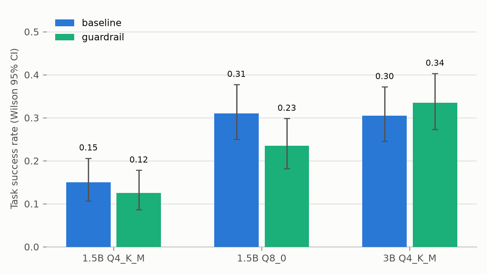

# slm-agent-eval

**How reliable are the small open-weight LLMs anyone can run for free as
multi-step tool agents — where do they fail, and how much does the cheapest
deterministic guardrail recover, as a function of quantization?**

Research portfolio project. The contribution is the rigorous evaluation:
pass^k reliability over seeded repeated trials, programmatic failure
attribution, an inference-time model-free mitigation measured with paired
statistics, and a Q4_K_M-vs-Q8_0 quantization axis — on 1–3B GGUF models,
reproducible at zero cost (Kaggle free GPU or any consumer CPU).

## Status

All phases complete. **Findings and paper-style write-up: `REPORT.md`.**
Headlines: at 1.5B, Q8_0 more than doubles agent success over the default
Q4_K_M build (+16pp, Holm p=2e-5) and changes *how* the model fails; a
deterministic schema-validation guardrail does not help small models and
significantly hurts at 1.5B-Q8 (−7.5pp), yet triples fault recovery at 3B;
pass^k collapses under repetition (best cell 0.34 → 0.08 at k=8); 1.5B models
recovered from 0/84 injected tool faults and usually hallucinate afterwards.



## Reproducing

Every number in REPORT.md regenerates from the committed raw logs — CI does
it on each push (`.github/workflows/reproduce.yml`):

```
pip install -r requirements.txt -r requirements-analysis.txt
python data/generate.py            # deterministic world (CI asserts no diff)
python -m grading.check_tasks      # all 25 golds resolve
python analysis/compare_labels.py  # grader vs blind hand labels (kappa)
python analysis/analyze.py --runs core_v1 ext_v1
python analysis/make_figures.py
```

Re-running the *experiments* (new episodes, ~2 GPU-h on a free Kaggle tier or
days on a consumer CPU): `ollama pull` the models in `configs/*.yaml`, then
`python run.py --config configs/core.yaml` (resumable; see `kaggle/core/` for
the cloud kernel).

`NOTES.md` is the chronological project log: every measurement, decision,
and correction, with evidence pointers.

## Layout

```
PHASE0_RESEARCH_FRAMING.md   research questions, verified prior work, hardware evidence
PHASE1_DESIGN.md             approved design: architecture, tasks, metrics, matrix, stats
NOTES.md                     running log (evidence for every claim)
harness/                     agent loop, guardrail, Ollama client, episode logging
tools/                       the 5 local tools + fault injector (all deterministic)
tasks/tasks.yaml             25 tasks in 5 slices; golds resolved from data at grade time
grading/                     success grading, first-failure attribution, integrity checks
data/                        seeded world generator + generated corpus/DB/facts
configs/                     experiment cells (core matrix, smoke)
run.py                       runner CLI (resumable per episode)
runs/                        episode logs (every reported number traces here)
kaggle/                      benchmark + pilot kernels for free-GPU execution
```

## Quick start (local)

```
pip install -r requirements.txt
python data/generate.py            # regenerate the synthetic world (seeded)
python -m grading.check_tasks      # verify all 25 golds resolve
ollama pull qwen2.5:1.5b           # or any config'd model
python run.py --config configs/smoke.yaml
```
